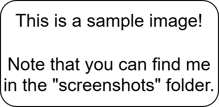
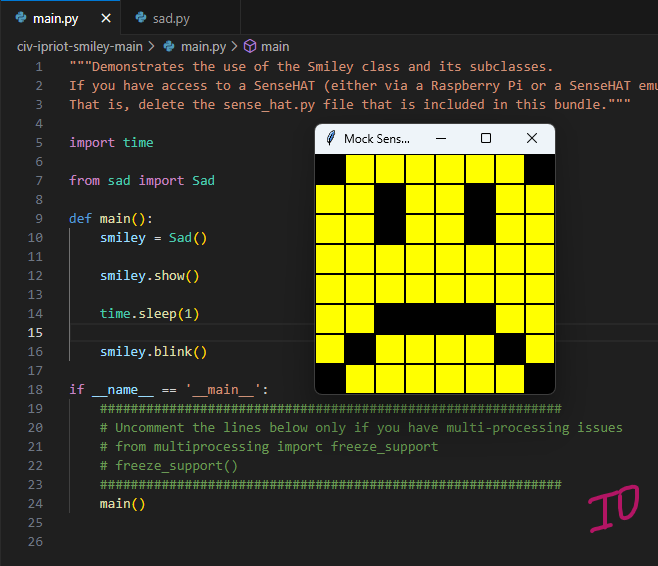
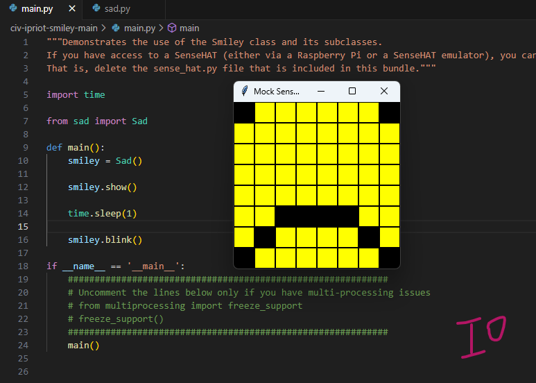
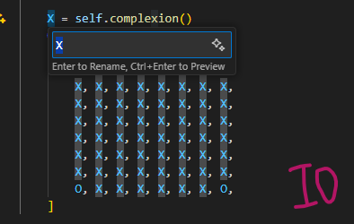
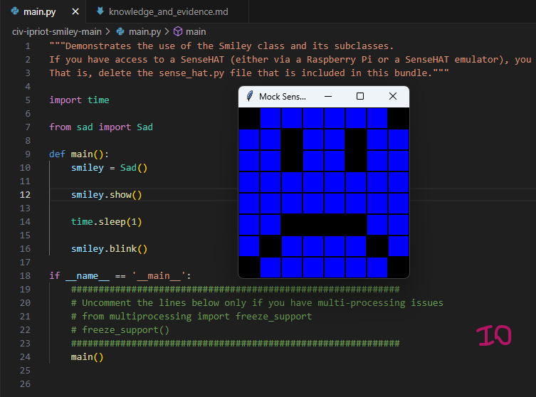
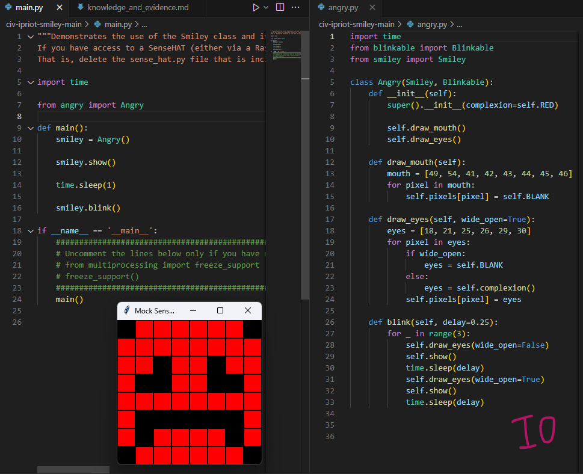

# Evidence and Knowledge

This document includes instructions and knowledge questions that must be completed to receive a _Competent_ grade on this portfolio task.

## 1. Required evidence

### 1.1. Answer all questions in this document

- Each answer should be complete, well-articulated, and within the specified word count limits (if added) for each question.
- Please make sure **all** external sources are properly cited.
- You must **use your own words**. Please include your full chat transcripts if you use generative AI in any way.
- Generative AI hallucinates, is not an authoritative source

### 1.2. Make all the required modifications to the code

- Please follow the instructions in this document to make the changes needed to the code.

- When requested to upload evidence, upload all screenshots to `screenshots/` and embed them in this document. For example:

```markdown

```



> Note the `!`, and the use of a relative path.

- You must upload the code into your GitHub repository.
- While you can use a branch, your code should be in main when you submit.
- Upload a zip of this repository to Blackboard when you are ready to submit.
- You will be notified of your result via Blackboard
- However, if using GitHub classrooms, you may also receive additional feedback on GitHub directly

### 1.3. Optional: Use of Raspberry Pi and SenseHat

Raspberry Pi or SenseHat is **optional** for this activity. You can use the included `sense_hat.py` file to simulate the SenseHat on your computer.

If you use a Pi, please **delete** the `sense_hat.py` file.

### 1.4. Accessible version of the code

This project relies on visual patterns that appear on an LED matrix. If you have any accessibility requirements, you can use the `udl/accessible` branch to complete the project. This branch provides an accessible code version that uses text-based patterns instead of visual ones.

Please discuss this with your lecturer before using that branch.

## 2. Specific Tasks & Questions

Address the following tasks and questions based on the code provided in this repository.

### 2.1. Set up the project locally

1. Fork this repository (if not using GitHub Classrooms)
2. Clone your repository locally
3. Run the project locally by executing the `main.py` file
4. Evidence this by providing screenshots of the project directory structure and the output of the `main.py` file


If you are running on a Raspberry Pi, you can use the following command to run the project and then screenshot the result:

```bash
ls
python3 main.py
```

### 2.2. Fundamental code comprehension

Answer each of the following questions **as they relate to that code** supplied by in this repository (ignore `sense_hat.py`):

1. Examine the code for the `smiley.py` file and provide an example of a variable of each of the following types and their corresponding values (`_` should be replaced with the appropriate values):

   | Type                    | name           | value                |
   | ----------------------- | -------------- | -------------------- |
   | built-in primitive type | dimmed         | True or False        |
   | built-in composite type | self.pixels    | list of tuples       |
   | user-defined type       | self.sense_hat | instance of SenseHat |

2. Fill in (`_`) the following table based on the code in `smiley.py`:

   | Object                  | Type               |
   | ----------------------- | ------------------ |
   | self.pixels             | List               |
   | A member of self.pixels | Tuple              |
   | self                    | Instance of Smiley |

3. Examine the code for `smiley.py`, `sad.py`, and `happy.py`. Give an example of each of the following control structures using an example from **each** of these files. Include the first line and the line range:

   | Control Flow | File      | First line | Line range |
   | ------------ | --------- | ---------- | ---------- |
   | sequence     | smiley.py | 15         | 15-26      |
   | selection    | sad.py    | 26         | 26-29      |
   | iteration    | happy.py  | 21         | 21-22      |

4. Though everything in Python is an object, it is sometimes said to have four "primitive" types. Examining the three files `smiley.py`, `sad.py`, and `happy.py`, identify which of the following types are used in any of these files, and give an example of each (use an example from the code, if applicable, otherwise provide an example of your own):

   | Type  | Used? | Example                             |
   | ----- | ----- | ----------------------------------- |
   | int   | Yes   | eyes = [10, 13, 18, 21]             |
   | float | No    | animation_speed = 1.5               |
   | str   | Yes   | """Show the smiley on the screen""" |
   | bool  | Yes   | dimmed                              |

5. Examining `smiley.py`, provide an example of a class variable and an instance variable (attribute). Explain **why** one is defined as a class variable and the other as an instance variable.

> An example of a class variable can be any of the colours variables, for example, WHITE = (255, 255, 255). Colours are constants and do not change per object, so they are defined in class and shared among all instances in the class.
> An example of an instance variable is self.sense_hat = SenseHat(). This variable allows each smiley to control its own display, as it is owned by each instance of the Smiley class.

6. Examine `happy.py`, and identify the constructor (initializer) for the `Happy` class:

   1. What is the purpose of a constructor (in general) and this one (in particular)?

   > A constructor is a special method that runs automatically when a new object is created. The purpose of a constructor is to initialise default values and set the internal state of an object.
   > In particular, the purpose of this constructor is to inherit the base smiley face from the Smiley class and customize the smiley face by drawing a happy mouth and eyes.

   2. What statement(s) does it execute (consider the `super` call), and what is the result?

   > The constructor of the Happy class executes the super().**init**() in order to call the constructor of its first parent class Smiley. Then it runs two methods: draw_mouth() to draw the mouth and draw_eyes() to draw the eyes of the happy smiley.

### 2.3. Code style

1. What code style is used in the code? Is it likely to be the same as the code style used in the SenseHat? Give to reasons as to why/why not:

> The code follows the official style PEP8 (classes use CamelCase, methods and variables use snake_case, use of comments and docstrings, proper indentation, etc).
> Both codes follow Python convention, but sense_hat.py does not have exactly the same style. The sense_hat.py uses more detailed docstrings and comments explaining every part of the code, making it more professional and clean. The other files have fewer docstrings and comments as those codes are written for educational purposes and are perfect for beginners.

2. List three aspects of this convention you see applied in the code.

> Use of docstrings that explain what the code does;
> Use of indentation in the code;
> Use of CONSTANTS in uppercase.

3. Give two examples of organizational documentation in the code.

> Module-docstrings in the main.py and sense_hat.py giving instructions to users (at the beginning of the code);
> Instructional and inline comments (for example, # Adjust this value between 0 and 1 for different dimming levels).

### 2.4. Identifying and understanding classes

> Note: Ignore the `sense_hat.py` file when answering the questions below

1. List all the classes you identified in the project. Indicate which classes are base classes and which are subclasses. For subclasses, identify all direct base classes.

Use the following table for your answers:

| Class Name | Super or Sub? | Direct parent(s)  |
| ---------- | ------------- | ----------------- |
| Smiley     | Super         | NotRealParent     |
| Sad        | Sub           | Smiley            |
| Happy      | Sub           | Smiley, Blinkable |
| Blinkable  | Super         | NotRealParent     |

2. Explain the concept of abstraction, giving an example from the project (note "implementing an ABC" is **not** in itself an example of abstraction). (Max 150 words)

> Abstraction is the process of hiding complex details in order to focus attention on parts of greater importance, making the code easier to understand and allowing all developers to interact with an object, focusing on what it does and not how it does it. For example, the abstraction in the project is shown in the Smiley class behaviour. The users can create smiley faces without worrying about the low-level details, such as how the pixels are managed to create those faces. By changing the specific pixels, the Happy and Sad classes create smiley faces with different expressions while users are focused only on calling the methods show() or blink(). This is an example of hiding the complex pixel manipulation inside the classes, making the interface easy and user-friendly.

3. What is the name of the process of deriving from base classes? What is its purpose in this project? (Max 150 words)

> The process of deriving from base classes is called inheritance. In Python, OOP inheritance is described by putting the superclass within parentheses of the child class. The subclass is less general than the class it derives from (superclass). Subclasses get all the attributes and functionality of their superclass. This allows subclasses to reuse code from superclasses without rewriting the code and to be able to add extra features. For example, in this project, classes Happy and Sad inherit the code from the Smiley class, and class Happy inherit the code from the Blinkable class.

### 2.5. Compare and contrast classes

Compare and contrast the classes Happy and Sad.

1. What is the key difference between the two classes?
   > The Happy class is made to create a happy smiley, and the Sad class creates a sad smiley.
2. What are the key similarities?
   > Both the Happy and Sad classes inherit from the Smiley class.
   > Both classes have methods draw_mouth() and draw_eyes().
3. What difference stands out the most to you and why?
   > The main difference is how the mouth on the face is drawn in each class. In both classes, different pixels are used to shape the mouth.
4. How does this difference affect the functionality of these classes
   > Depending on which class is used, the user can draw a specific smiley with its own happy or sad expression, depending on the situation.

### 2.6. Where is the Sense(Hat) in the code?

1. Which class(es) utilize the functionality of the SenseHat?
   > The Smiley class uses the SenseHat directly in its **init**() method. The Happy and Sad classes use the Smiley class, so they use the SenseHat indirectly through their parent class.
2. Which of these classes directly interact with the SenseHat functionalities?
   > The Smiley class directly interacts with the SenseHat.
3. Discuss the hiding of the SenseHAT in terms of encapsulation (100-200 Words)
   > Encapsulation is bundling of data with methods that operate on that data, restricting direct access to some of an object's components. In this project, the Smiley class hides the direct interaction with the SenseHat. The Smiley creates a SenseHat object inside itself (self.sense_hat = SenseHat) and uses this object to send data to the LED display. The Smiley class does not let other classes communicate to the SenseHat directly but provides functions such as method show() that updates the pixels on the screen. This organisation makes the code easier to manage and understand, as classes Happy and Sad do not need to control SenseHat; they only need to set the pixels and call show() method to display them on the LED. If the work of the SenseHat changes, the user will need to update only the Smiley class, making the process easier.

### 2.7. Sad Smileys Can’t Blink (Or Can They?)

Unlike the `Happy` smiley, the current implementation of the `Sad` smiley does not possess the ability to blink. Let's first explore how blinking has been implemented in the Happy Smiley by examining the blink() method, which takes one argument that determines the duration of the blink.

**Understanding Blink Mechanism:**

1. Does the code's author believe that every `Smiley` should be able to blink? Explain.

> No, the code's author does not believe that every "Smiley" should be able to blink. Blinking functionality is separated in its own class called "Blinkable", and not every Smiley inherits from it. Only the Happy class Smileys are designed to blink, as it inherits from both the classes Smiley and Blinkable. On the other hand, the Sad class only inherits from the Smiley, making it impossible to blink. This setup makes blinking a separate feature, and not every Smiley is expected to blink.

2. For those smileys that blink, does the author expect them to blink in the same way? Explain.

> No, the author does not expect smileys to blink in the same way. The class "Blinkable" defines a rule and a blink() method but does not specify how blinking should be done. Each class can make its own version on blink() and decide what it must have.

3. Referring to the implementation of blink in the Happy and Sad Smiley classes, give a brief explanation of what polymorphism is.

> Polymorphism is the ability of, in this case, the method blink() to have different forms or behaviours. In this project, the Happy class has method blink(), and we are able to add the same method in the Sad class but adjust it for our needs. In this case, we call blink() in both classes, but internally, the function would do different things.

4. How is inheritance used in the blink method, and why is it important for polymorphism?

> In this project, for example, in the Happy class, inheritance is used for accessing the Smiley and Blinkable classes. In this case, the Happy class must write its own version of the blink(). In other words, each class handles Blinkable in its own way and creates its own version of blink().

1. **Implement Blink in Sad Class:**

   - Create a new method called `blink` within the Sad class. Ensure you use the same method signature as in the Happy class:

   ```python
   def blink(self, delay=0.25):
       pass  # Replace 'pass' with your implementation
   ```

2. **Code Implementation:** Implement the code that allows the Sad smiley to blink. Use the implementation from the Happy Smiley as a reference. Ensure your new method functions similarly by controlling the blink duration through the `delay` argument.

3. **Testing the Implementation:**

- Test the new blink functionality on your Raspberry Pi or within the Python classes provided. You might need to adjust the `main.py` script to incorporate Sad Smiley's new blinking capability.

Include a screenshot of the sad smiley or the modified `main.py`:




- Observe and document the Sad smiley as it blinks its eyes. Describe any adjustments or issues encountered during implementation.

  > After adding a blink() functionality in the Sad class, I updated the main.py to create a Sad Smiley instead of a Happy one. The blinking effect worked as desired, and the Sad Smiley blinks 3 times to add it more personality. There were no issues during the implementation. This shows how we can reuse and slightly change behaviour in subclasses using the same method, blink(), but still keep things unique.

  ### 2.8. If It Walks Like a Duck…

  Previously, you implemented the blink functionality for the Sad smiley without utilizing the class `Blinkable`. Assuming you did not use `Blinkable` (even if you actually did), consider how the Sad smiley could blink similarly to the Happy smiley without this specific class.

  1. **Class Type Analysis:** What kind of class is `Blinkable`? Inspect its superclass for clues about its classification.

     > Blinkable is an abstract class, as it inherits from ABC, which stands for Abstract Base Class. It is meant to define an interface or structure for other classes but cannot be used on its own. Any class that inherits from the Blinkable class must implement the blink() method.

  2. **Class Implementation:** `Blinkable` is a class intended to be implemented by other classes. What generic term describes this kind of class, which is designed for implementation by others? **Clue**: Notice the lack of any concrete implementation and the naming convention.

  > The generic term for the class "Blinkable", which is designed to be implemented by others, is an abstract base class or an interface. This kind of class is used to define what a class should do but not how it must do it.

  3. **OO Principle Identification:** Regarding your answer to question (2), which Object-Oriented (OO) principle does this represent? Choose from the following and justify your answer in 1-2 sentences: Abstraction, Polymorphism, Inheritance, Encapsulation.

  > This represents the principle of abstraction. It hides the details of how blinking should work and any class that uses the Blinkable class must have the blink() method and set up their own blinking behaviour.

  4. **Implementation Flexibility:** Explain why you could grant the Sad Smiley a blinking feature similar to the Happy Smiley's implementation, even without directly using `Blinkable`.

  > To grant the Sad Smiley a blinking feature without directly using the "Blinkable" class is possible by writing the method directly inside the Sad class.

  5. **Concept and Language Specificity:** In relation to your response to question (4), what is this capability known as, and why is it feasible in Python and many other dynamically typed languages but not in most statically typed programming languages like C#? **Clue** This concept is hinted at in the title of this section.

  > It is known as Duck typing: if it walks like a duck and quacks like a duck, it probably is a duck. You do not have to know what type is the object to call a method (as long as the object has it). In most statically typed programming languages like C#, you must declare that your class implements an interface. However, Python is more flexible as it does not care what type the object is, it only checks its behaviour at runtime.

  ***

  ## 3. Refactoring

  ### 3.1. Does a Smiley Have to Be Yellow?

  While our current implementation predominantly features yellow smileys, emotional expressions like sickness or anger typically utilize colors like green, red, or orange. We'll explore the feasibility of integrating these colors into our smileys.

  1. **Defined Colors and Their Location:**

     1. Which colors are defined and in which class(s)?
        > The following colours are defined in the Smiley class: white, green, red, yellow, blank. Other classes are able to use them as they inherit colours from the Smiley class.
     2. What type of variables hold these colors? Are the values expected to change during the program's execution? Explain your answer.
        > These colours are held by constants, but they are represented as tuples. The values are not expected to change during the program execution as they are fixed. This is indicated by the use of uppercase variable names. Since tuples are immutable, once these colour values are set, they cannot be altered during the execution of the program.
     3. Add the color blue to the appropriate class using the appropriate format and values.
        > Added: BLUE = (0, 0, 255)

  2. **Usage of Color Variables:**

     1. In which classes are the color variables used?
        > The colour variables are used in the Smiley, Happy and Sad classes. In the Smiley class, the colour variables are defined. As Sad and Happy classes inherit from the Smiley class, they can utilize the colour variables.

  3. **Simple Method to Change Colors:**
  4. What is the easiest way you can think to change the smileys to green? Easiest, not necessarily the best!
     > The easiest way to change smileys to green is to change the YELLOW colour constant to the value of green colour by changing its RGB value to green. It will look like this: YELLOW = (0, 255, 0). Happy and Sad classes will automatically update.

  Here's a revised version of the "Flexible Colors – Step 1" section for the smiley project, incorporating your specifications for formatting and content updates:

  ### 3.2. Flexible Colors – Step 1

  Changing the color of the smileys once is straightforward, but it isn't very flexible. To facilitate various colors for smileys, it is advisable not to hardcode values in any class. This approach was identified earlier as a necessary change. Let's start by removing the built-in assumptions about color in our classes.

  1. **Add a method called `complexion` to the `Smiley` class:** Implement this instance method to return `self.YELLOW`. Using the term "complexion" instead of "color" provides a more abstract terminology that focuses on the meaning rather than implementation.

  2. **Refactor subclasses to use the `complexion` method:** Modify any subclass that directly accesses the color variable to instead utilize the new `complexion` method. This ensures that color handling is centralized and can be easily modified in the future.

  3. **Determine the applicable Object-Oriented principle:** Consider whether Abstraction, Polymorphism, Inheritance, or Encapsulation best applies to the modifications made in this step.

  4. **Verify the implementation:** Ensure that the modifications function as expected. The smileys should still display in yellow, confirming that the new method correctly replaces the direct color references.

  This step is crucial for setting up a more flexible system for color management in the smiley display logic, allowing for easy adjustments and extensions in the future.

  ### 3.3. Flexible Colors – Step 2

  Having removed the hardcoded color values, we now enhance the base class to support dynamic color assignments more effectively.

  1. **Modify the `__init__()` method in the `Smiley` class:** Introduce a default argument named `complexion` and assign `YELLOW` as its default value. This allows the instantiation of smileys with customizable colors.

  2. **Introduce a new instance variable:** Create a variable called `my_complexion` and assign the `complexion` parameter to it. This step ensures that each smiley instance can maintain its own color state.

  3. **Rationale for `my_complexion`:** Using a distinct instance variable like `my_complexion` avoids potential conflicts with the method parameter names and clarifies that it is an attribute specific to the object.

  4. **Bulk rename:** We want to update our grid to use the value of complexion, but we have so many `Y`'s in the grid. Use your IDE's refactoring tool to rename all instances of the **symbol** `Y` to `X`. Where `X` is the value of the `complexion` variable. Include a screenshot evidencing you have found the correct refactor tool and the changes made.

  

  5. **Update the `complexion` method:** Adjust this method to return `self.my_complexion`, ensuring that whatever color is assigned during instantiation is what the smiley displays.

  6. **Verification:** Run the updated code to confirm that Smileys still defaults to yellow unless specified otherwise.

  ### 3.4. Flexible Colors – Step 3

  With the foundational changes in place, it's now possible to implement varied smiley colors for different emotional expressions.

  1. **Adjust the `Sad` class initialization:** In the `Sad` class's initializer method, change the superclass call to include the `complexion` argument with the value `self.BLUE`, as shown:

     ```python
     super().__init__(complexion=self.BLUE)
     ```

  2. **Test color functionality for the Sad smiley:** Execute the program to verify that the Sad smiley now appears blue.

  

  3. **Ensure the Happy smiley remains yellow:** Confirm that changes to the Sad smiley do not affect the default color of the Happy smiley, which should still display in yellow.

  4. **Design and Implement An Angry Smiley:** Create an Angry smiley class that inherits from the `Smiley` class. Set the color of the Angry smiley to red by passing `self.RED` as the `complexion` argument in the superclass call.

  

  ***
